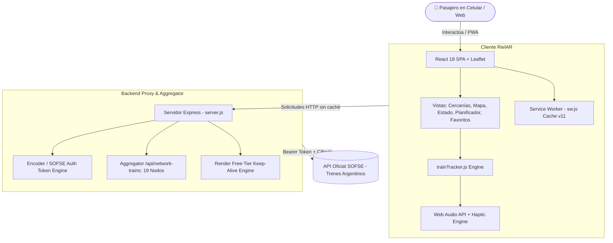

<div align="center">

# 🚆 RielAR • Movilidad Urbana en Tiempo Real

**Plataforma de alta precisión para el monitoreo, seguimiento GPS y estado de la red de trenes metropolitanos del AMBA.**

[](https://rielar-app.onrender.com)
[](https://reactjs.org/)
[](https://vitejs.dev/)
[](https://expressjs.com/)
[](https://leafletjs.com/)
[](https://web.dev/progressive-web-apps/)
[](LICENSE)

<br/>

Creado y desarrollado con pasión por **[Martin Calvo Ruiz](https://github.com/Az3r0th6)**.

</div>

---

## 📖 Acerca de RielAR

**RielAR** es una aplicación web progresiva (PWA) de última generación diseñada para los pasajeros y usuarios del sistema ferroviario del **Área Metropolitana de Buenos Aires (AMBA)**. 

Conectada directamente con la infraestructura oficial de **Trenes Argentinos (SOFSE)** mediante un backend proxy con autenticación cifrada en tiempo real, RielAR ofrece seguimiento milimétrico de formaciones en circulación, tiempos de arribo exactos sincronizados con los cronogramas oficiales de partida, alertas operacionales en vivo y una experiencia visual inspirada en las guías de diseño de iOS.

---

## ✨ Características Principales

### 🛰️ 1. Trackeo GPS en Vivo y Mapa de Red
- **Visualización en mapa interactivo:** Mapas basados en Leaflet con capa nocturna de alto contraste y pins de alta resolución por línea.
- **Formaciones en circulación simultáneas:** Más de 40 trenes activos monitoreados en simultáneo en todas las líneas metropolitanas.
- **Fijación milimétrica en andén:** Cuando una formación se encuentra a menos de 25 segundos o arribada, el marcador se clava 100% en las coordenadas físicas del andén con velocidad en 0 km/h y estado *"En andén"*.
- **Desaceleración física realista:** Al ingresar a plataforma (entre 25s y 65s), simula una desaceleración suave desde 26 km/h hasta 12 km/h.
- **Normalizador de estaciones y acrónimos:** Resuelve automáticamente discrepancias en abreviaturas oficiales (ej. `V. Ballester` ➔ `Villa Ballester`, `J. L. Suarez` ➔ `J. L. Suárez`, `Gral. Urquiza` ➔ `General Urquiza`).

### ⏱️ 2. Próximos Arribos con Sincronización Doble
- **Conteo regresivo segundo a segundo:** Evita congelamientos y desfases con un decrementador local en tiempo real.
- **Alineación con el cronograma oficial:** Visualiza simultáneamente los minutos restantes (`en 3 min`) y la **hora oficial de partida de andén** (`14:24 hs`, `salida.programada`), erradicando cualquier brecha con la app oficial de Trenes Argentinos.
- **Indicador de puntualidad:** Identifica de un vistazo si el servicio circula a horario, con demoras (`+X min`) o con marcha adelantada.
- **Sentidos claros:** Distinción automática de sentido *"A Retiro / CABA"* vs. *"A Provincia"*, andén asignado y número de formación.

### 📱 3. Ficha Detallada de Formación (TrainDetailSheet)
- **Vista Itinerario de Paradas:** Recorrido completo estación por estación con hora oficial de tabla, horario estimado por GPS y horario real de paso en paradas superadas.
- **Vista Mapa en Vivo del Tren:** Permite acompañar el trayecto de la formación seleccionada con botón de centrado dinámico que respeta el zoom y paneo del usuario.
- **Velocímetro físico dinámico:** Muestra la velocidad crucero en tiempo real (~40-45 km/h) calibrada a los tramos de vía del AMBA.
- **Fijar en Dynamic Island:** Permite anclar el tren en un widget flotante accesible desde cualquier sección.
- **Alarma de llegada:** Notificación y alerta sonora al aproximarse a la estación de destino.

### 🏝️ 4. Dynamic Island Flotante
- Widget interactivo inspirado en iOS que permanece visible mientras navegás por la app.
- Muestra el número de tren, cabecera de destino, andén y la cuenta regresiva en vivo.

### 🚦 5. Estado de la Red y Alertas en Tiempo Real
- Cobertura integral de todas las líneas de Trenes Argentinos:
  - ⚡ **Línea Mitre** (Ramales Tigre, José León Suárez y Bartolomé Mitre)
  - 🚅 **Línea Sarmiento** (Once - Moreno - Mercedes - Lobos)
  - 🚄 **Línea Roca** (Constitución - La Plata, Ezeiza, Alejandro Korn, Bosques)
  - 🚈 **Línea San Martín** (Retiro - Caseros - Pilar - Dr. Cabred)
  - 🚆 **Línea Belgrano Sur** (Dr. Sáenz - González Catán - Marinos del Crucero Gral. Belgrano)
  - 🚊 **Tren de la Costa** (Maipú - Delta)
  - 🏞️ **Servicios Regionales** (Cañuelas, Chascomús, etc.)
- Clasificación de alertas operacionales por criticidad (interrupciones, demoras, cancelaciones, cambios de andén).

### 🧭 6. Planificador de Viajes Directos
- Búsqueda intuitiva entre cualquier par de estaciones de la red.
- Listado de próximas salidas directas con horarios de partida, andenes y tiempo de viaje estimado.

### 🔊 7. Retroalimentación Háptica y Sonora Web Audio
- **AudioContext con desbloqueo táctil:** Tonos armónicos sintetizados nativamente sin archivos de audio externos (`refresh`, `success`, `click`, `alert`).
- **Vibración háptica móvil:** Patrones adaptados para Android y navegadores móviles (`25ms`, `[35, 50, 40ms]`).
- **Botón de actualización instantánea:** Permite forzar el refresco de arribos con confirmación visual de tilde verde y marca de tiempo exacta (`Actualizado HH:mm:ss`).

### 📝 8. Centro de Reporte de Incidentes de Pasajeros
- Formulario de reporte categorizado (arribos, ubicación en mapa, interfaz, otros).
- Autocompletado rápido de estaciones con sugerencias en tiempo real.
- Historial de reportes guardados localmente (`localStorage`).

---

## 🛠️ Stack Tecnológico

| Capa | Tecnologías |
| :--- | :--- |
| **Frontend** | React 18, Vite 6, Leaflet, React-Leaflet, Lucide React |
| **Estilos & UI** | Vanilla CSS modular, Apple iOS Glassmorphism, Paleta HSL Dark Mode |
| **Backend** | Node.js, Express.js (ES Modules), CORS, Node-Fetch |
| **Datos Ferroviarios** | API Oficial de SOFSE (Trenes Argentinos) + Algoritmo de cifrado inverso |
| **PWA** | Service Worker (`rielar-v10`) con caché estática offline y Web App Manifest |
| **Hosting & Deploy** | Render Cloud Platform con motor Keep-Alive 24/7 |

---

## 🏛️ Arquitectura del Sistema



---

## 📂 Estructura del Repositorio

```text
├── public/
│   ├── icon.svg                  # Icono vectorial oficial de la aplicación
│   ├── manifest.json             # Manifiesto PWA para instalación móvil
│   └── sw.js                     # Service Worker con versionado de caché
├── src/
│   ├── api/
│   │   └── sofseClient.js        # Cliente HTTP con cache-busting y fallbacks
│   ├── components/
│   │   ├── BugReportSection.jsx  # Centro de reportes y feedback de pasajeros
│   │   ├── DynamicIsland.jsx     # Widget flotante estilo Dynamic Island
│   │   ├── ErrorBoundary.jsx     # Captura de errores de renderizado
│   │   ├── iPhoneFrame.jsx       # Contenedor responsivo con estética móvil
│   │   ├── LineBadge.jsx         # Insignia oficial con colores por línea
│   │   ├── TabBar.jsx            # Barra de navegación inferior
│   │   └── TrainDetailSheet.jsx  # Ficha interactiva de seguimiento del tren
│   ├── data/
│   │   ├── linesData.js          # Metadatos, colores y terminales por línea
│   │   └── officialStations.json # Catálogo oficial georreferenciado (265 estaciones)
│   ├── utils/
│   │   ├── geo.js                # Cálculo de distancias Haversine
│   │   ├── notifications.js      # Motores de sonido Web Audio y vibración
│   │   ├── time.js               # Formateo de horarios y cuenta regresiva
│   │   └── trainTracker.js       # Algoritmo de posicionamiento físico y GPS
│   ├── views/
│   │   ├── FavoritesView.jsx     # Estaciones favoritas del usuario
│   │   ├── LineStatusView.jsx    # Estado de ramales y alertas de red
│   │   ├── MapView.jsx           # Mapa interactivo de red en tiempo real
│   │   ├── MoreView.jsx          # Configuración, créditos e información
│   │   ├── NearbyView.jsx        # Estaciones cercanas y próximos arribos
│   │   └── TripPlannerView.jsx   # Planificador de viajes directos
│   ├── App.jsx                   # Componente raíz y navegación
│   ├── index.css                 # Sistema de diseño global y temas
│   └── main.jsx                  # Entrada principal React
├── dist/                         # Bundle compilado para producción
├── index.html                    # Plantilla HTML5 con meta-etiquetas PWA
├── package.json                  # Dependencias y scripts
├── server.js                     # Servidor Express, API proxy y Keep-Alive
└── vite.config.js                # Configuración de compilación Vite
```

---

## 🚀 Instalación y Ejecución Local

### Prerrequisitos
- **Node.js**: Versión 18.0.0 o superior instalada.
- **Git**: Para clonar el repositorio.

### Pasos

1. **Clonar el repositorio:**
   ```bash
   git clone https://github.com/Az3r0th6/rielar-app.git
   cd rielar-app
   ```

2. **Instalar dependencias:**
   ```bash
   npm install
   ```

3. **Ejecutar en entorno de desarrollo:**
   ```bash
   npm run dev
   ```
   > Este comando iniciará simultáneamente el servidor proxy Express en el puerto `3001` y el servidor Vite en el puerto `5173`.

4. **Abrir en el navegador:**
   Ingresá a `http://localhost:5173` para interactuar con la aplicación.

5. **Compilar para producción:**
   ```bash
   npm run build
   ```

6. **Iniciar servidor de producción:**
   ```bash
   npm start
   ```

---

## 🌐 Endpoints de la API Backend

El servidor Express expone los siguientes endpoints optimizados con cabeceras estrictas `Cache-Control: no-store, no-cache`:

| Endpoint | Método | Descripción |
| :--- | :---: | :--- |
| `/api/lines` | `GET` | Obtiene el listado oficial de líneas / gerencias. |
| `/api/branches?idGerencia=:id` | `GET` | Lista de ramales correspondientes a una línea. |
| `/api/stations?idRamal=:id` | `GET` | Catálogo de estaciones de un ramal específico. |
| `/api/arrivals/:stationId` | `GET` | Arribos en vivo de una estación con parámetros anti-caché (`_t`). |
| `/api/network-trains` | `GET` | Agregador en tiempo real de más de 40 formaciones activas en 19 nodos clave. |
| `/api/network-status` | `GET` | Estado operacional consolidado de todas las líneas y alertas vigentes. |
| `/api/all-stations` | `GET` | Directorio maestro de estaciones georreferenciadas de la red AMBA. |
| `/api/health` | `GET` | Ping de diagnóstico y objetivo del motor Keep-Alive. |

---

## 📱 Instalación como App Nativa (PWA)

RielAR es una aplicación **Zero-Install** que no requiere pasar por Google Play Store ni Apple App Store:

- **En iOS (Safari):**
  1. Abrí [rielar-app.onrender.com](https://rielar-app.onrender.com).
  2. Tocá el botón de **Compartir** (icono cuadrado con flecha hacia arriba).
  3. Seleccioná **"Agregar a Inicio"** (*Add to Home Screen*).
  4. La app se abrirá en pantalla completa sin barras del navegador.

- **En Android (Chrome):**
  1. Abrí [rielar-app.onrender.com](https://rielar-app.onrender.com).
  2. Tocá el menú de tres puntos o el banner inferior **"Instalar RielAR"**.
  3. Confirmá la instalación para disfrutar de acceso instantáneo desde el cajón de aplicaciones.

---

## 👨‍💻 Autor y Créditos

- **Desarrollador Principal:** [Martin Calvo Ruiz](https://github.com/Az3r0th6)
- **Fuente de Datos Oficial:** Trenes Argentinos Operaciones (SOFSE) / Ministerio de Transporte de la Nación.
- **Cartografía:** [OpenStreetMap](https://www.openstreetmap.org/) & Leaflet.

---

## 📄 Licencia

Este proyecto se encuentra bajo la licencia **MIT**.

<div align="center">
  <sub>Construido con tecnología moderna para mejorar la movilidad urbana de miles de pasajeros cada día.</sub>
</div>
